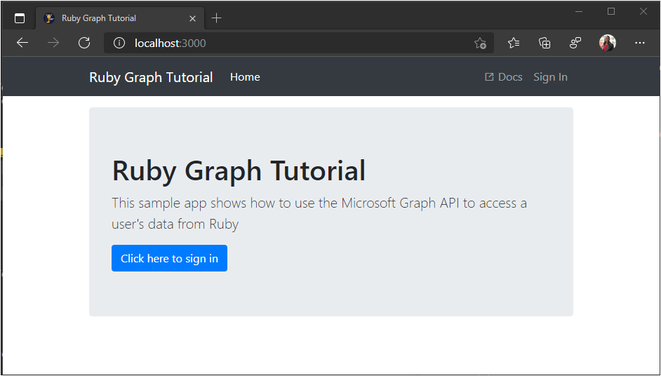

<!-- markdownlint-disable MD002 MD041 -->

In this exercise you will use [Ruby on Rails](https://rubyonrails.org/) to build a web app.

1. If you don't already have Rails installed, you can install it from your command-line interface (CLI) with the following command.

    ```Shell
    gem install rails -v 6.0.2.2
    ```

1. Open your CLI, navigate to a directory where you have rights to create files, and run the following command to create a new Rails app.

    ```Shell
    rails new graph-tutorial
    ```

1. Navigate to this new directory and enter the following command to start a local web server.

    ```Shell
    rails server
    ```

1. Open your browser and navigate to `http://localhost:3000`. If everything is working, you will see a "Yay! You're on Rails!" message. If you don't see that message, check the [Rails getting started guide](http://guides.rubyonrails.org/).

## Install gems

Before moving on, install some additional gems that you will use later:

- [omniauth-oauth2](https://github.com/omniauth/omniauth-oauth2) for handling sign-in and OAuth token flows.
- [omniauth-rails_csrf_protection](https://github.com/cookpad/omniauth-rails_csrf_protection) for adding CSRF protection to OmniAuth.
- [httparty](https://github.com/jnunemaker/httparty) for making calls to Microsoft Graph.
- [nokogiri](https://github.com/sparklemotion/nokogiri) to process HTML bodies of email.
- [activerecord-session_store](https://github.com/rails/activerecord-session_store) for storing sessions in the database.

1. Open **./Gemfile** and add the following lines.

    :::code language="ruby" source="../demo/graph-tutorial/Gemfile" id="GemFileSnippet":::

1. In your CLI, run the following command.

    ```Shell
    bundle install
    ```

1. In your CLI, run the following commands to configure the database for storing sessions.

    ```Shell
    rails generate active_record:session_migration
    rake db:migrate
    ```

1. Create a new file called `session_store.rb` in the **./config/initializers** directory, and add the following code.

    :::code language="ruby" source="../demo/graph-tutorial/config/initializers/session_store.rb" id="SessionStoreSnippet":::

## Design the app

In this section you'll create the basic UI for the app.

1. Open **./app/views/layouts/application.html.erb** and replace its contents with the following.

    :::code language="html" source="../demo/graph-tutorial/app/views/layouts/application.html.erb" id="LayoutSnippet":::

    This code adds [Bootstrap](http://getbootstrap.com/) for simple styling, and [Font Awesome](https://fontawesome.com/) for some simple icons. It also defines a global layout with a nav bar.

1. Open **./app/assets/stylesheets/application.css** and add the following to the end of the file.

    :::code language="css" source="../demo/graph-tutorial/app/assets/stylesheets/application.css" id="CssSnippet":::

1. Generate a home page controller with the following command.

    ```Shell
    rails generate controller Home index
    ```

1. Configure the `index` action on the `Home` controller as the default page for the app. Open **./config/routes.rb** and replace its contents with the following

    ```ruby
    Rails.application.routes.draw do
      get 'home/index'
      root 'home#index'

      # Add future routes here

    end
    ```

1. Open **./app/view/home/index.html.erb** and replace its contents with the following.

    :::code language="html" source="../demo/graph-tutorial/app/views/home/index.html.erb" id="HomeSnippet":::

1. Save all of your changes and restart the server. Now, the app should look very different.

    
