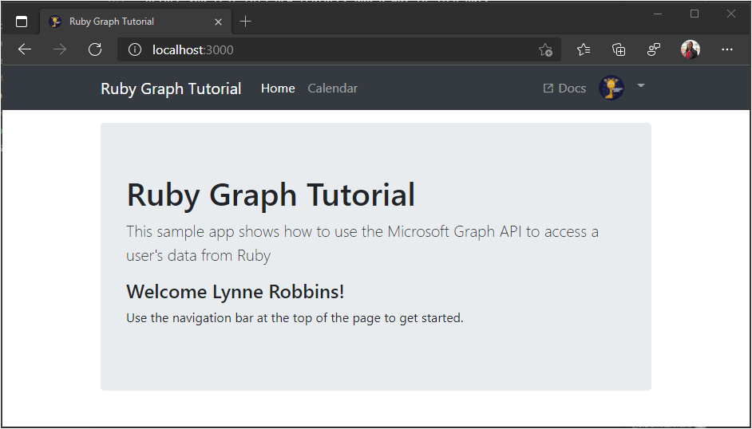
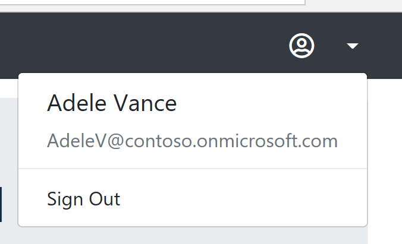

<!-- markdownlint-disable MD002 MD041 -->

In this exercise you will extend the application from the previous exercise to support authentication with Azure AD. This is required to obtain the necessary OAuth access token to call the Microsoft Graph. In this step you will integrate the [omniauth-oauth2](https://github.com/omniauth/omniauth-oauth2) gem into the application, and create a custom OmniAuth strategy.

First, create a separate file to hold your app ID and secret. Create a new file called `oauth_environment_variables.rb` in the `./config` folder, and add the following code.

```ruby
ENV['AZURE_APP_ID'] = 'YOUR_APP_ID_HERE'
ENV['AZURE_APP_SECRET'] = 'YOUR_APP_SECRET_HERE'
ENV['AZURE_SCOPES'] = 'openid profile email offline_access user.read calendars.read'
```

Replace `YOUR_APP_ID_HERE` with the application ID from the Application Registration Portal, and replace `YOUR_APP_SECRET_HERE` with the password you generated.

> [!IMPORTANT]
> If you're using source control such as git, now would be a good time to exclude the `oauth_environment_variables.rb` file from source control to avoid inadvertently leaking your app ID and password.

Now add code to load this file if it's present. Open the `./config/environment.rb` file and add the following code before the `Rails.application.initialize!` line.

```ruby
# Load OAuth settings
oauth_environment_variables = File.join(Rails.root, 'config', 'oauth_environment_variables.rb')
load(oauth_environment_variables) if File.exist?(oauth_environment_variables)
```

## Setup OmniAuth

You've already installed the `omniauth-oauth2` gem, but in order to make it work with the Azure OAuth endpoints, you need to [create an OAuth2 strategy](https://github.com/omniauth/omniauth-oauth2#creating-an-oauth2-strategy). This is a Ruby class that defines the parameters for making OAuth requests to the Azure provider.

Create a new file called `microsoft_graph_auth.rb` in the `./lib` folder, and add the following code.

```ruby
require 'omniauth-oauth2'

module OmniAuth
  module Strategies
    # Implements an OmniAuth strategy to get a Microsoft Graph
    # compatible token from Azure AD
    class MicrosoftGraphAuth < OmniAuth::Strategies::OAuth2
      option :name, :microsoft_graph_auth

      DEFAULT_SCOPE = 'openid email profile User.Read'.freeze

      # Configure the Azure v2 endpoints
      option  :client_options,
              site:          'https://login.microsoftonline.com',
              authorize_url: '/common/oauth2/v2.0/authorize',
              token_url:     '/common/oauth2/v2.0/token'

      # Send the scope parameter during authorize
      option :authorize_options, [:scope]

      # Unique ID for the user is the id field
      uid { raw_info['id'] }

      # Get additional information after token is retrieved
      extra do
        {
          'raw_info' => raw_info
        }
      end

      def raw_info
        # Get user profile information from the /me endpoint
        @raw_info ||= access_token.get('https://graph.microsoft.com/v1.0/me').parsed
      end

      def authorize_params
        super.tap do |params|
          params['scope'.to_sym] = request.params['scope'] if request.params['scope']
          params[:scope] ||= DEFAULT_SCOPE
        end
      end

      # Override callback URL
      # OmniAuth by default passes the entire URL of the callback, including
      # query parameters. Azure fails validation because that doesn't match the
      # registered callback.
      def callback_url
        options[:redirect_uri] || (full_host + script_name + callback_path)
      end
    end
  end
end
```

Take a moment to review what this code does.

- It sets the `client_options` to specify the Azure v2 endpoints.
- It specifies that the `scope` parameter should be sent during the authorize phase.
- It maps the `id` property of the user as the unique ID for the user.
- It uses the access token to retrieve the user's profile from Microsoft Graph to fill in the `raw_info` hash.
- It overrides the callback URL to ensure that it matches the registered callback in the app registration portal.

Now that we've defined the strategy, we need to configure OmniAuth to use it. Create a new file called `omniauth_graph.rb` in the `./config/initializers` folder, and add the following code.

```ruby
require 'microsoft_graph_auth'

Rails.application.config.middleware.use OmniAuth::Builder do
  provider :microsoft_graph_auth,
           ENV['AZURE_APP_ID'],
           ENV['AZURE_APP_SECRET'],
           scope: ENV['AZURE_SCOPES']
end
```

This code will execute when the app starts. It loads up the OmniAuth middleware with the `microsoft_graph_auth` provider, configured with the environment variables set in `oauth_environment_variables.rb`.

## Implement sign-in

Now that the OmniAuth middleware is configured, you can move on to adding sign-in to the app. Run the following command in your CLI to generate a controller for sign-in and sign-out.

```Shell
rails generate controller Auth
```

Open the `./app/controllers/auth_controller.rb` file. Add the following method to the `AuthController` class.

```ruby
def signin
  redirect_to '/auth/microsoft_graph_auth'
end
```

All this method does is redirect to the route that OmniAuth expects to invoke our custom strategy.

Next, add a callback method to the `AuthController` class. This method will be called by the OmniAuth middleware once the OAuth flow is complete.

```ruby
def callback
  # Access the authentication hash for omniauth
  data = request.env['omniauth.auth']

  # Temporary for testing!
  render json: data.to_json
end
```

For now all this does is render the hash provided by OmniAuth. We'll use this to verify that our sign-in is working before moving on. Before we test, we need to add the routes to `./config/routes.rb`.

```ruby
get 'auth/signin'

# Add route for OmniAuth callback
match '/auth/:provider/callback', to: 'auth#callback', via: [:get, :post]
```

Now update the views to use the `signin` action. Open `./app/views/layouts/application.html.erb`. Replace the line `<a href="#" class="nav-link">Sign In</a>` with the following.

```html
<%= link_to "Sign In", {:controller => :auth, :action => :signin}, :class => "nav-link" %>
```

Open the `./app/views/home/index.html.erb` file and replace the `<a href="#" class="btn btn-primary btn-large">Click here to sign in</a>` line with the following.

```html
<%= link_to "Click here to sign in", {:controller => :auth, :action => :signin}, :class => "btn btn-primary btn-large" %>
```

Start the server and browse to `https://localhost:3000`. Click the sign-in button and you should be redirected to `https://login.microsoftonline.com`. Login with your Microsoft account and consent to the requested permissions. The browser redirects to the app, showing the hash generated by OmniAuth.

```json
{
  "provider": "microsoft_graph_auth",
  "uid": "eb52b3b2-c4ac-4b4f-bacd-d5f7ece55df0",
  "info": {
    "name": null
  },
  "credentials": {
    "token": "eyJ0eXAi...",
    "refresh_token": "OAQABAAA...",
    "expires_at": 1529517383,
    "expires": true
  },
  "extra": {
    "raw_info": {
      "@odata.context": "https://graph.microsoft.com/v1.0/$metadata#users/$entity",
      "id": "eb52b3b2-c4ac-4b4f-bacd-d5f7ece55df0",
      "businessPhones": [
        "+1 425 555 0109"
      ],
      "displayName": "Adele Vance",
      "givenName": "Adele",
      "jobTitle": "Retail Manager",
      "mail": "AdeleV@contoso.onmicrosoft.com",
      "mobilePhone": null,
      "officeLocation": "18/2111",
      "preferredLanguage": "en-US",
      "surname": "Vance",
      "userPrincipalName": "AdeleV@contoso.onmicrosoft.com"
    }
  }
}
```

## Storing the tokens

Now that you can get tokens, it's time to implement a way to store them in the app. Since this is a sample app, for simplicity's sake, you'll store them in the session. A real-world app would use a more reliable secure storage solution, like a database.

Open the `./app/controllers/application_controller.rb` file. You'll add all of our token management methods here. Because all of the other controllers inherit the `ApplicationController` class, they'll be able to use these methods to access the tokens.

Add the following method to the `ApplicationController` class. The method takes the OmniAuth hash as a parameter and extracts the relevant bits of information, then stores that in the session.

```ruby
def save_in_session(auth_hash)
  # Save the token info
  session[:graph_token_hash] = auth_hash.dig(:credentials)
  # Save the user's display name
  session[:user_name] = auth_hash.dig(:extra, :raw_info, :displayName)
  # Save the user's email address
  # Use the mail field first. If that's empty, fall back on
  # userPrincipalName
  session[:user_email] = auth_hash.dig(:extra, :raw_info, :mail) ||
                         auth_hash.dig(:extra, :raw_info, :userPrincipalName)
end
```

Now add accessor functions to retrieve the user name, email address, and access token back out of the session.

```ruby
def user_name
  session[:user_name]
end

def user_email
  session[:user_email]
end

def access_token
  session[:graph_token_hash][:token]
end
```

Finally, add some code that will run before any action is processed.

```ruby
before_action :set_user

def set_user
  @user_name = user_name
  @user_email = user_email
end
```

This method sets the variables that the layout (in `application.html.erb`) uses to show the user's information in the nav bar. By adding it here, you don't have to add this code in every single controller action. However, this will also run for actions in the `AuthController`, which isn't optimal. Add the following code to the `AuthController` class in `./app/controllers/auth_controller.rb` to skip the before action.

```ruby
skip_before_action :set_user
```

Then, update the `callback` function in the `AuthController` class to store the tokens in the session and redirect back to the main page. Replace the existing `callback` function with the following.

```ruby
def callback
  # Access the authentication hash for omniauth
  data = request.env['omniauth.auth']

  # Save the data in the session
  save_in_session data

  redirect_to root_url
end
```

## Implement sign-out

Before you test this new feature, add a way to sign out. Add the following action to the `AuthController` class.

```ruby
def signout
  reset_session
  redirect_to root_url
end
```

Add this action to `./config/routes.rb`.

```ruby
get 'auth/signout'
```

Now update the view to use the `signout` action. Open `./app/views/layouts/application.html.erb`. Replace the line `<a href="#" class="dropdown-item">Sign Out</a>` with:

```html
<%= link_to "Sign Out", {:controller => :auth, :action => :signout}, :class => "dropdown-item" %>
```

Restart the server and go through the sign-in process. You should end up back on the home page, but the UI should change to indicate that you are signed-in.



Click the user avatar in the top right corner to access the **Sign Out** link. Clicking **Sign Out** resets the session and returns you to the home page.



## Refreshing tokens

If you look closely at the hash generated by OmniAuth, you'll notice there are two tokens in the hash: `token` and `refresh_token`. The value in `token` is the access token, which is sent in the `Authorization` header of API calls. This is the token that allows the app to access the Microsoft Graph on the user's behalf.

However, this token is short-lived. The token expires an hour after it is issued. This is where the `refresh_token` value becomes useful. The refresh token allows the app to request a new access token without requiring the user to sign in again. Update the token management code to implement token refresh.

Open `./app/controllers/application_controller.rb` and add the following `require` statements at the top:

```ruby
require 'microsoft_graph_auth'
require 'oauth2'
```

Then add the following method to the `ApplicationController` class.

```ruby
def refresh_tokens(token_hash)
  oauth_strategy = OmniAuth::Strategies::MicrosoftGraphAuth.new(
    nil, ENV['AZURE_APP_ID'], ENV['AZURE_APP_SECRET']
  )

  token = OAuth2::AccessToken.new(
    oauth_strategy.client, token_hash[:token],
    refresh_token: token_hash[:refresh_token]
  )

  # Refresh the tokens
  new_tokens = token.refresh!.to_hash.slice(:access_token, :refresh_token, :expires_at)

  # Rename token key
  new_tokens[:token] = new_tokens.delete :access_token

  # Store the new hash
  session[:graph_token_hash] = new_tokens
end
```

This method uses the [oauth2](https://github.com/oauth-xx/oauth2) gem (a dependency of the `omniauth-oauth2` gem) to refresh the tokens, and updates the session.

Now put this method to use. To do that, make the `access_token` accessor in the `ApplicationController` class a bit smarter. Instead of just returning the token from the session, it will first check if it is close to expiration. If it is, then it will refresh before returning the token. Replace the current `access_token` method with the following.

```ruby
def access_token
  token_hash = session[:graph_token_hash]

  # Get the expiry time - 5 minutes
  expiry = Time.at(token_hash[:expires_at] - 300)

  if Time.now > expiry
    # Token expired, refresh
    new_hash = refresh_tokens token_hash
    new_hash[:token]
  else
    token_hash[:token]
  end
end
```
