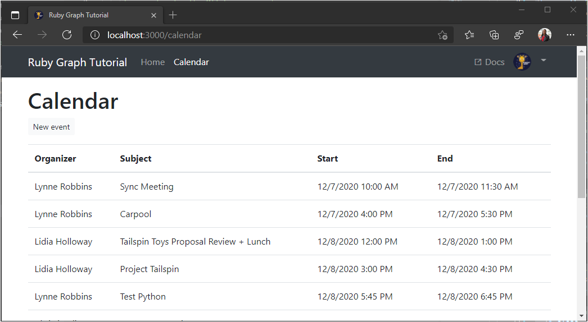

<!-- markdownlint-disable MD002 MD041 -->

In this exercise you will incorporate the Microsoft Graph into the application. For this application, you will use the [httparty](https://github.com/jnunemaker/httparty) gem to make calls to Microsoft Graph.

## Create a Graph helper

1. Create a helper to manage all of your API calls. Run the following command in your CLI to generate the helper.

    ```Shell
    rails generate helper Graph
    ```

1. Open **./app/helpers/graph_helper.rb** and replace the contents with the following.

    ```ruby
    require 'httparty'

    # Graph API helper methods
    module GraphHelper
      GRAPH_HOST = 'https://graph.microsoft.com'.freeze

      def make_api_call(method, endpoint, token, headers = nil, params = nil, payload = nil)
        headers ||= {}
        headers[:Authorization] =  "Bearer #{token}"
        headers[:Accept] = 'application/json'

        params = params || {}

        if method.upcase == 'GET'
          HTTParty.get "#{GRAPH_HOST}#{endpoint}",
                        headers: headers,
                        query: params
        elsif method.upcase == 'POST'
          headers['Content-Type'] = 'application/json'
          HTTPParty.post "#{GRAPH_HOST}#{endpoint}",
            headers: headers,
            query: params,
            body: payload ? payload.to_json : nil
        end
      end
    end
    ```

Take a moment to review what this code does. It makes a simple GET or POST request via the `httparty` gem to the requested endpoint. It sends the access token in the `Authorization` header, and it includes any query parameters that are passed.

For example, to use the `make_api_call` method to do a GET to `https://graph.microsoft.com/v1.0/me?$select=displayName`, you could call it like so:

```ruby
make_api_call 'GET', '/v1.0/me', access_token, { '$select': 'displayName' }
```

You'll build on this later as you implement more Microsoft Graph features into the app.

## Get calendar events from Outlook

1. In your CLI, run the following command to add a new controller.

    ```Shell
    rails generate controller Calendar index new
    ```

1. Add the new route to **./config/routes.rb**.

    ```ruby
    get 'calendar', to: 'calendar#index'
    ```

1. Add a new method to the Graph helper to [get a calendar view](https://docs.microsoft.com/graph/api/calendar-list-calendarview?view=graph-rest-1.0). Open **./app/helpers/graph_helper.rb** and add the following method to the `GraphHelper` module.

    :::code language="ruby" source="../demo/graph-tutorial/app/helpers/graph_helper.rb" id="GetCalendarSnippet":::

    Consider what this code is doing.

    - The URL that will be called is `/v1.0/me/calendarview`.
        - The `Prefer: outlook.timezone` header causes the start and end times in the results to be adjusted to the user's time zone.
        - The `startDateTime` and `endDateTime` parameters set the start and end of the view.
        - The `$select` parameter limits the fields returned for each events to just those the view will actually use.
        - The `$orderby` parameter sorts the results by start time.
        - The `$top` parameter limits the results to 50 events.
    - For a successful response, it returns the array of items contained in the `value` key.

1. Open **./app/controllers/calendar_controller.rb** and replace its entire contents with the following.

    ```ruby
    # Calendar controller
    class CalendarController < ApplicationController
      include GraphHelper

      def index
        # Get the IANA identifier of the user's time zone
        time_zone = get_iana_from_windows(user_timezone)

        # Calculate the start and end of week in the user's time zone
        startDateTime = Date.today.beginning_of_week(:sunday).in_time_zone(time_zone).to_time()
        endDateTime = startDateTime.advance(days: 7)

        @events = get_calendar_view access_token, startDateTime, endDateTime, user_timezone || []
        render json: @events
      rescue RuntimeError => e
        @errors = [
          {
            message: 'Microsoft Graph returned an error getting events.',
            debug: e
          }
        ]
      end
    end
    ```

1. Restart the server. Sign in and click the **Calendar** link in the nav bar. If everything works, you should see a JSON dump of events on the user's calendar.

## Display the results

Now you can add HTML to display the results in a more user-friendly manner.

1. Open **./app/views/calendar/index.html.erb** and replace its contents with the following.

    :::code language="html" source="../demo/graph-tutorial/app/views/calendar/index.html.erb" id="CalendarSnippet":::

    That will loop through a collection of events and add a table row for each one.

1. Remove the `render json: @events` line from the `index` action in **./app/controllers/calendar_controller.rb**.

1. Refresh the page and the app should now render a table of events.

    
