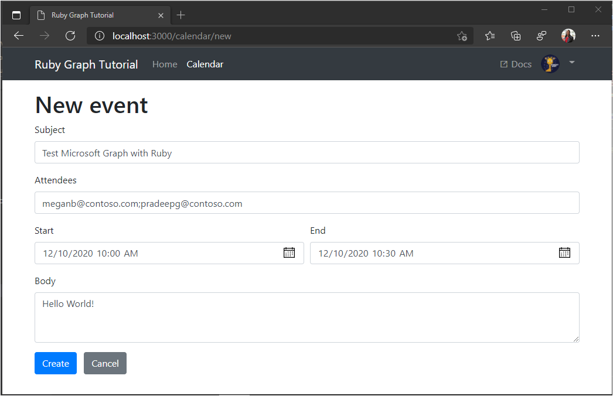

<!-- markdownlint-disable MD002 MD041 -->

In this section you will add the ability to create events on the user's calendar.

1. Open **./app/helpers/graph_helper.rb** and add the following method to the **Graph** class.

    :::code language="ruby" source="../demo/graph-tutorial/app/helpers/graph_helper.rb" id="CreateEventSnippet":::

1. Open **./app/controllers/calendar_controller** and add the following route to the **CalendarController** class.

    :::code language="ruby" source="../demo/graph-tutorial/app/controllers/calendar_controller.rb" id="CreateEventRouteSnippet":::

1. Open **./config/routes.rb** and add the new route.

    ```ruby
    post 'calendar/new', :to => 'calendar#create'
    ```

1. Open **./app/views/calendar/new.html.erb** and replace its contents with the following.

    :::code language="html" source="../demo/graph-tutorial/app/views/calendar/new.html.erb" id="NewEventFormSnippet":::

1. Save your changes and refresh the app. On the **Calendar** page, select the **New event** button. Fill in the form and select **Create** to create a new event.

    
